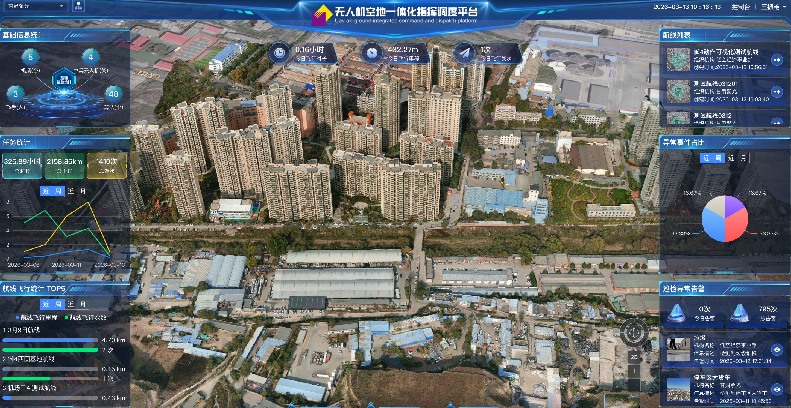
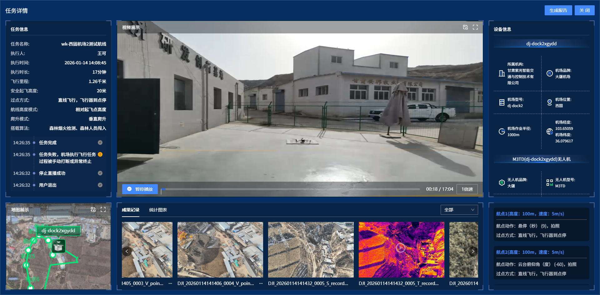

# 甘肃紫光无人机飞控平台
##  1. 项目概述

###  1.1 项目名称

无人机飞控平台

###  1.2 项目背景

随着无人机在千行百业的广泛应用，“怎么管好、用好”成了新难题。当前，许多单位的无人机都是“各自飞”，数据不互通，任务不协同，不仅设备利用率低，还容易出现调度冲突和安全盲区。本平台正是为了解决这一现实痛点而生：它将所有类型的无人机和巡检设备纳入统一管理，实现智能化任务派发、实时画面回传、AI自动识别隐患，并通过数据分析辅助决策，让每一架无人机都能在最需要的地方发挥作用。

###  1.3 项目介绍

本平台是无人机规模化运营的一体化智能调度与作业中枢。它将分散的设备、任务与数据整合，致力于通过**自动化飞行、智能化调度、AI实时识别及全链路数据价值挖掘**，为客户提供安全、高效、智能化的低空智能解决方案，已应用在能源巡检、应急指挥、智慧城市、交通巡检、生态环保、农林执法等诸多领域。

###  1.4 系统亮点

1、多种部署模式：支持公有云、私有化及专网部署，满足不同场景安全与架构需求。

2、多种飞行方式：支持航线飞行、多次指点飞行、全自动执飞、手控接飞以及断点续飞。

3、支持RTK与视觉双重精准降落：实现厘米级精准归航。

4、集群实时监控：支持多架无人机的直播视频分屏观看，同时提供二维码分享功能。

5、丰富AI算法库：已满足行业应用的算法50+，已与私有化大模型平台进行对接。

6、适配多品牌机场：平台集成了不同厂商的基站，增强了产品的复用率及扩展性。

7、适配多品牌无人机：平台适配了多家厂商的无人机，解决了无人机管理兼容性问题。

8、集成多元化挂载：平台集成多种挂载设备，满足各类任务的应用。

9、开放API接口：支持与业务应用等平台及终端无缝集成。

10、多种无人机的接入方式：兼容大疆行业级、消费级等多种主流无人机快速接入。

### 1.5 运行环境要求

- Node.js  ≥ 18.0（推荐 20.x LTS）
- pnpm ≥ 8.0（推荐） / yarn / npm
- 现代浏览器（Chrome/Edge/Firefox 最新版最佳）
- 推荐使用 nvm / fnm / volta 管理 Node 版本
- 建议内存 ≥ 8GB

### 1.6 运行命令

- git clone https://github.com/gsunis/gsunis-uav-web.git
- cd gsunis-uav-web
- pnpm install
- pnpm dev

## 2. 系统功能模块

### 2.1首页

* **多模态地图可视化**：支持2D/3D双模式动态实景地图展示，单兵无人机、机场及禁飞区范围等动态呈现。

* **基础信息统计‌**：涵盖机场及无人机设备数量、飞手、算法等核心数据。

* **任务执行统计‌**：统计任务执行时长、飞行里程、任务架次等关键指标。

* **航线飞行分析**‌：统计航迹飞行次数，评估航线执行效率。

* **异常事件分析‌**：量化AI异常事件占比，支持趋势与根因分析。

* **事件智能预警**：实时推送AI识别的异常事件预警信息。

* **航线任务列表**：展示当前机构航线列表，支持一键快速执行。

### 2.2 飞控调度模块

* **基站全景监控**：实时监控无人机智能基站的内外部环境状态，包含基站的气象条件、内外部高清摄像头、电池状态、电量信息等。

* **设备远程调试**：支持对机场、无人机、遥控器设备进行远程调试、重启等操作。

* **指点飞行**：在地图中直接指定目标点，实现无人机的自主飞行，并支持多次指点和断点续飞。

* **航线飞行**：直接调度预设航线，在飞行过程中也可指点飞行。

* **飞行参数实时监控**：实时采集无人机的飞行参数（速度、高度、位置）、通信信号及电池数据，实现飞行状态全面可视化。

* **挂载组件远程控制**：支持远程操控无人机挂载设备，实现喊话广播、云台调节、抛投触发、探照灯开关及警灯控制等。

* **手控接飞**：正在飞行的无人机可随时通过键盘或摇杆手动操控。

* **任务断点续飞**:任务中断后，系统自动记录航线断点，并支持从断点继续执行剩余任务。

* **AI事件实时分析**：基于实时飞行的视频流进行AI分析，标记异常事件，提供多种方式的提醒。

* **实时取证**：支持飞行过程中的画面截取，提供问题标注与事件描述，形成完整的取证记录链条。

### 2.3 联合行动模块

* **无人机集群监控**：支持多架无人机的直播视频分屏观看，同时提供二维码分享功能，便于直播视频共享。

* **全局定位**：支持多架无人机实时位置与航线可视化展示。

### 2.4 航线与任务模块

* **航点航线**：支持设置连续航点，规划自定义飞行路径。

* **面状航线**：一键生成正射或倾斜摄影采集所需的精细化面状扫描航线。

* **内置安全预警机制**：在规划与编辑航线时，系统支持**近地预警**与**碰撞检测**功能

* **航线导入、复制、绘制**：具备地图点击绘制、KMZ文件导入、现有航线复制三种创建方式。

* **全局飞行参数配置**：‌提供飞行高度、速度、过点方式、安全起飞高度、航线高度模式、爬升模式等核心飞行控制参数设置，实现全面的飞行参数调控。

* **‌航点精细化设置**：‌支持各航点独立配置速度、高度、过点方式，可设定无人机偏航角、云台角度、变焦、广角、拍照、悬停、喊话等多样化动作指令，实现精准飞行控制。

* ‌**航点AI算法配置**：支持在航线上搭载多类AI算法，实现智能识别预警。

* **即时任务**：支持手动创建和随时下发临时巡检任务。

* **定时任务**：支持设置单次、日、周、月等周期性自动巡检任务。

* **单兵任务**：支持针对单个无人机的任务管理。

### 2.5 巡检记录模块

* **成果记录展示**：系统实现巡检照片、取证及视频的集中存储、智能分类与高效检索，支持播放、下载等全流程操作。

* **巡检报告查看、导出**：系统支持自动生成巡检任务的巡检报告，生成后可实时预览、下载。

* **AI智能分析**：任务结束后支持对回放视频进行异常事件分析。

### 2.6 AI异常事件管理模块

* **AI识别事件管理**：对AI识别的异常事件进行统一分类管理，包含异常事件核实等。

* **事件地图分布展示**：将所有事件在地图上进行可视化标注，支持按事件类型、时间范围等条件进行动态筛选和聚合展示。

* **事件勘察**：系统智能识别事件周边机场资源，支持一键派遣勘察任务。

### 2.7 算法管理模块

* **算法参数设置**：支持用户自定义调整算法核心参数，实现算法的灵活适配与优化。

* **算法状态管理**：支持随时启用或禁用特定算法，便于算法版本迭代、性能调优和应急处置。

### 2.8 设备管理模块

* **机场管理**：统一维护机场的基本信息（编码、型号、运行状态等）,支持为机场预设无人机应急备降点，提升异常情况下的飞行安全保障能力。

* **无人机管理**：提供完整的无人机设备档案管理，涵盖设备基本信息、启用状态、挂载组件配置等核心要素。

### 2.9 模型库模块

* **照片建模**：支持基于巡检照片集生成二维平面图、三维模型。

* **二维正射图管理**：通过面状航线任务生成二维模型。

* **三维模型管理**：存储和展示通过倾斜摄影生成的三维模型，支持多角度浏览。

### 2.10 图层与电子围栏管理模块

* **空域安全管理**：支持用户在地图上自定义绘制并展示限飞区域，直观保障飞行合规与安全。

* **灵活任务标注**：提供标准的点、线、面地图元素绘制工具，方便用户精准标记巡检目标、规划飞行路径、框定任务范围。

* **实景三维融合**：支持导入与展示高精度的实景三维模型作为基础底图。

* **二维正射影像底图**：支持导入与展示高精度的二维正射影像作为基础底图。

* **多样化图层渲染**：支持矢量地图、三维地形、卫星影像等多种图层的叠加展示与切换。

### 2.10 运营支撑管理模块

* **增值服务管理**：集中管理无人机、挂载等设备的服务有效期、保险期限等关键信息，并支持智能预警，有效防控因设备等资质过期导致的作业中断与安全风险。

* **飞手电子档案**：集中管理飞手、机长等人员的执照信息。

* **飞行策略管理**：无人机执行飞行任务前以保障飞行安全的参数及要求，实现在有约束的情况下，智能飞行。

* **喊话管理**：统一维护喊话内容，支持语音喊话、文字喊话，可在航线中预设喊话内容，提升应急指挥、现场疏导等场景的信息传达效率。
 
 
 
 

### 2.11 多源设备接入

* **大疆机场接入**：支持大疆机场自动接入平台。

* **非大疆机场接入**：支持不同品牌和型号无人机的统一接入与管理。

* **单兵模式接入**：平台全面兼容行业级与消费级无人机，实现不同品牌、型号设备的无缝接入，完整保存飞行历史数据，提供便捷的数据检索与回溯功能。

## 3. 应用案例
### 3.1 某建筑行业应用案例
在某大型建筑工地，本系统集成AI视觉算法，实时识别工人安全帽佩戴、安全设备状态（如反光衣、安全带）及禁区闯入行为，有效降低违规操作风险，提升施工现场安全管理水平。

<table>
  <tr>
    <td style="text-align: center;">
      
    </td>
    <td style="text-align: center;">
      
    </td>
  </tr>
</table>

### 3.2 公路相关单位案例
在某公路相关单位，系统集成无人机巡检与AI图像识别算法，实现对高速公路交通事故、车辆拥堵、滑坡隐患、路面污染涂改、违规构筑等多种场景的自动化巡检与智能识别，辅助管理部门快速响应、科学决策，全面提升道路安全与运营效率。

<table>
  <tr>
    <td style="text-align: center;">
      

        
      

    </td>
    <td style="text-align: center;">
      

        
      

    </td>
  </tr>
</table>
<table>
  <tr>
    <td style="text-align: center;">
      

        
      

    </td>
    <td style="text-align: center;">
      

        
      

    </td>
  </tr>
</table>

### 3.3 某林草应用案例
在某山林草地区，系统通过无人机巡护与AI图像识别，实现森林火灾早期预警及盗伐行为监测，覆盖面积达 500 平方公里。

<table>
  <tr>
    <td style="text-align: center;">
      
    </td>
    <td style="text-align: center;">
      
    </td>
  </tr>
</table>

### 3.4 车载无人机应用
在某公路巡检单位，系统将无人机集成于巡检车辆，可在车辆行驶中起降，实现高速公路日常巡检、事故勘察、拥堵监测及地质灾害应急响应，显著提升巡检效率。

<table>
  <tr>
    <td style="text-align: center;">
      
    </td>
   
  </tr>
</table>

# 联系我们
如果您在使用甘肃紫光无人机飞控平台过程中有任何想法、建议或疑问，欢迎通过以下方式联系我们，我们也将通过这些频道实时发布最新动态。

- **QQ 群**：620055156  
    
  *点击图片或扫描二维码加入群聊，我们会提供相关技术支持，全力为大家答疑解惑。*

- **其他渠道**：  
  [gitee](https://gitee.com/uav-gsunis/gsunis-uav-web)